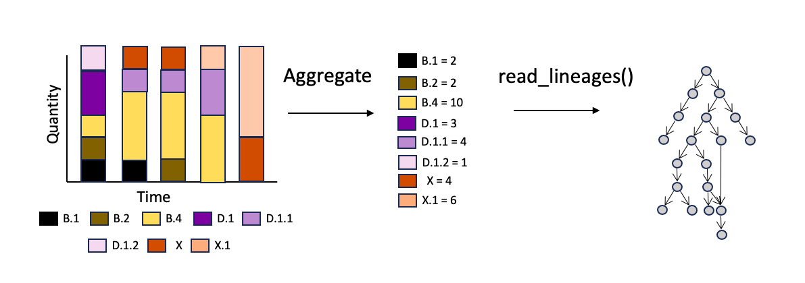
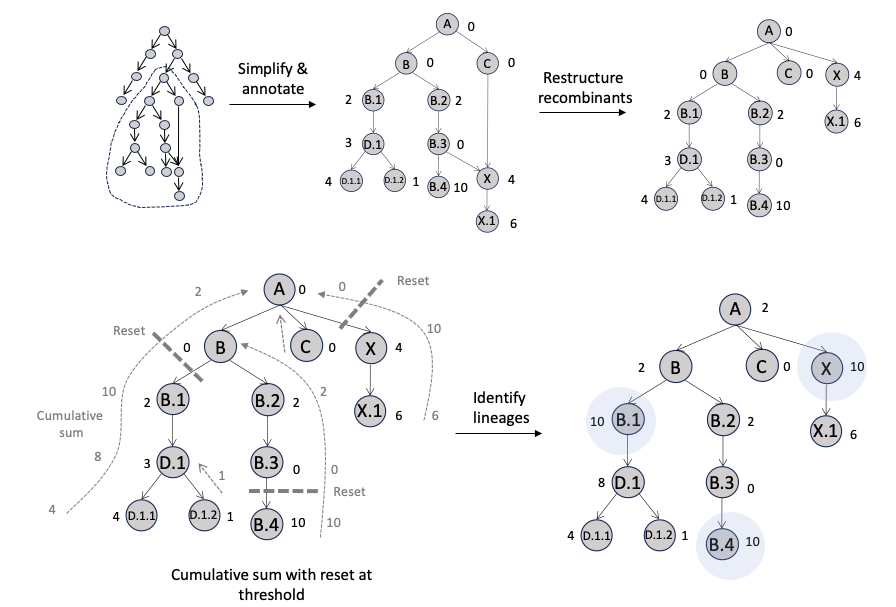
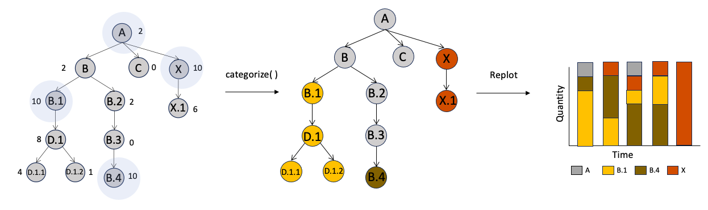

# linnet

The **lin**eage **net**work package was developed to model SARS-CoV-2
Pango alias lineages as a directed network/graph. This graph can be used
to identify parental or sub-lineages of a given lineage, and empirically
or manually categorize sub-lineages into predominant parental lineages
in genomic surveillance and epidemiological analyses.

## Installation

You can install the development version of linnet from
[GitHub](https://github.com/) with:

``` r
# install.packages("devtools")

devtools::install_github("ChadFibke/linnet")
```

## Usage

### Read

First lets download all current SARS-CoV-2 Pango lineages:

``` r
example_graph <- read_lineages()
```

The `read_lineages()` function will always download the current Pango
data. You would need to save the graph to file and read it in to
reproduce the results you achieved on a given day.

`igraph::write_graph(example_graph, file = "/Path/to/lineage_graph.graphml"), format = "graphml")`

### Scan

There are some cases when we are interested in the which linage(s)
spawned a lineage of interest, or see all sub-lineages of a given
lineage.

``` r
# List all lineages downstream of NW.1
decedents(example_graph, "NW.1")
#>  [1] "NW.1.1"   "NW.1.2"   "NW.1.7"   "NW.1.3"   "NW.1.4"   "NW.1.5"   "NW.1.6"   "NW.1.8"   "NW.1.1.1" "NW.1.2.1" "NW.1.2.2" "NW.1.2.3"
#> [13] "NW.1.2.4" "NW.1.2.5" "NW.1.2.6" "NW.1.7.1" "NW.1.7.2" "NW.1.7.3" "NW.1.7.4" "XGB"      "QM.1"     "QM.2"     "QM.3"     "RG.1"    
#> [25] "RG.1.1"   "RG.1.2"

# What if I wanted all sub-lineages which were not recombination events and all
# lineages which were mutational descendents of recombinants?
decedents(example_graph, "NW.1", remove_recombinants = TRUE)
#>  [1] "NW.1.1"   "NW.1.2"   "NW.1.7"   "NW.1.3"   "NW.1.4"   "NW.1.5"   "NW.1.6"   "NW.1.8"   "NW.1.1.1" "NW.1.2.1" "NW.1.2.2" "NW.1.2.3"
#> [13] "NW.1.2.4" "NW.1.2.5" "NW.1.2.6" "NW.1.7.1" "NW.1.7.2" "NW.1.7.3" "NW.1.7.4" "QM.1"     "QM.2"     "QM.3"     "RG.1"     "RG.1.1"  
#> [25] "RG.1.2"

# What recombined to make XBB again?
parents(example_graph, "XBB")
#> [1] "BM.1.1.1" "BJ.1"
```

### Categorize

The linnet package can also categorize observed lineages into their
closest parental groups. All recombinant lineages, and lineages which
descend recombinants are grouped into a “Recombinants” category.
However, adding a recombinant lineage of interest to the parental group
will categorize all decedents of this lineages into this group, and will
categorize all other recombinant into the “Recombinants” category. All
other lineages which do not descend from a parental group are placed
into set default lineage category.

``` r
# Categorize all observed lineages into  Variants of Concern (VoC):
# Alpha (B.1.1.7), Beta (B.1.351), Gamma (P.1) Delta (B.1.617.2) and Omicron (B.1.1.529)

categorize(example_graph, lineage_of_interest = c("P.1.9", "AY.5.5", "KP.3.1", "XFG"),
           parental_group = c("B.1.1.7", "B.1.351", "P.1", "B.1.617.2", "B.1.1.529") )
#> [1] "P.1"          "B.1.617.2"    "B.1.1.529"    "Recombinants"

# What if I am only interest in a very select few lineages, and want a catch all category?
categorize(example_graph, lineage_of_interest = c("KP.1", "KP.2", "LP.8", "JN.1" ),
           parental_group = c("JN.1.11.1", "KP.1.1.3"),
           default_lineage = "Other" )
#> [1] "JN.1.11.1" "JN.1.11.1" "KP.1.1.3"  "Other"
```

Sometimes we know which groups we are interested in. However, there are
times we would like to categorize based on the quantity of lineages.
Linnet has the ability to detect the most granular lineage groups, which
either meet a threshold or are the top n predominant lineage groups in
your data. This function works with any quantity (relative frequency,
counts, or other numeric values).

In the below example lets imagine we have the following aggregate data
of several lineages and would like to simplify to parental groups which
represent at least 15% of observed lineages.

``` r
# Empirically identify parental lineages above 15%
groups <- detect_groups(example_graph,
              lineages = c("KP.1", "KP.2", "KP.1.1.3", "LP.1", "LP.8", "XEF", "XEF.1", "XEF.2"),
               values =  c( 0.10, 0.10, 0.15, 0.05 , 0.20, 0.11, 0.20, 0.09),
              threshold = 0.15 )

print(groups)
#> [1] "JN.1.11.1" "KP.1.1.3"  "LP.8"      "XEF"       "XEF.1"

# Now categorize observed lineages into their parental groups
categorize(example_graph,
           lineage_of_interest = c("KP.1", "KP.2", "KP.1.1.3", "LP.1", "LP.8", "XEF", "XEF.1", "XEF.2"),
           parental_group = groups )
#> [1] "JN.1.11.1" "JN.1.11.1" "KP.1.1.3"  "KP.1.1.3"  "LP.8"      "XEF"       "XEF.1"     "XEF"
```

The figures below shows a typical workflow and how `detect_groups()` is
operating.

The first step is to generate an aggregate of our lineage frequency data
for a period of time. In addition, the user would need to load in all
SARS-CoV-2 lineages into their session:



The `detect_groups()` will take the lineages/aggregates and lineage
graph as input. There are thousands of SARS-CoV-2 lineages, so the code
will first subset the full graph to one with all observed lineages, the
most recent common ancestor of all observed lineages, and all unobserved
lineages between. This sub-graph will have all aggregate counts assigned
to the corresponding observed lineages. Next, all recombinants, and
their descendants, are pruned as a clade, and reattached as a direct
descendant to the root lineage. This is to avoid propagating the
recombinant values twice. The code will then conduct a cumulative sum of
the lineage values from the leaves/bottom of the graph to the root/top.
This cumulative sum uses a breadth first search to sum the values of all
the direct children to their parent lineage. This process is repeated
until a threshold is met. Once met, the cumulative sum is reset to zero
and traverses up the tree as above, but ignores lineages which has met
the threshold. The code then returns all lineages which have met the
threshold.



The identified lineages can then be used in the `categorize()` function
to group all supporting sub-lineages into their predominant parental
groups. Less frequent lineages, which do not descend a parental lineage,
are assigned to a default lineage category set by the user. In turn,
this can simplify noisy plots to more predominant lineages.


